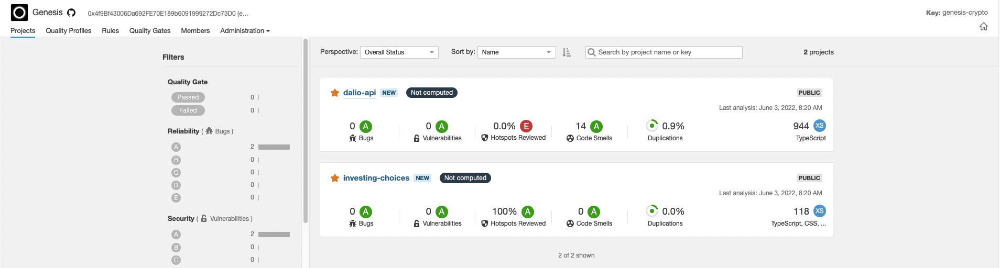

# Investing Choices

Este projeto front-end foi feito utilizando React.

## Scripts

Lista de comandos para rodar a aplicacao:

```
npm start
```

> Roda a aplicacao em modo de desenvolvimento

## Extra

No projeto esta habilitado uma funcao muito interessante que gerencia dependencias e subdependencias de arquivos manifest da aplicacao!

Para vizualizar entre:

> Insights >> Dependency Graph

Outro recurso utilizado para ajudar a melhorar no processo de desenvolvimento foi a adocao do Sonar Cloud, uma ferramenta muito poderosa que entra servicos para melhoria da qualidade de codigo, analise de vulnerabilidade e analise estatica de codigo.


